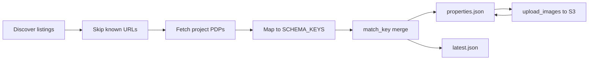

<p align="center">
  
</p>

<h1 align="center">ZirconDS</h1>

<p align="center">
  Multi-source Indian real-estate scraper that merges <strong>unique BHK/unit JSON</strong> into a growing archive — never inventing prices, areas, or RERA.
</p>

<p align="center">
  <a href="https://zircon-ds-alpha.vercel.app/"></a>
  <a href="https://zirconds.onrender.com/"></a>
  
  
  
  
</p>

<p align="center">
  <strong>Live UI:</strong>
  <a href="https://zircon-ds-alpha.vercel.app/">https://zircon-ds-alpha.vercel.app/</a>
  ·
  <a href="https://zirconds.onrender.com/">https://zirconds.onrender.com/</a>
</p>

<p align="center">
  
</p>

## Live links

| What | URL |
|------|-----|
| Verification UI (Vercel) | [zircon-ds-alpha.vercel.app](https://zircon-ds-alpha.vercel.app/) |
| API / full UI (Render) | [zirconds.onrender.com](https://zirconds.onrender.com/) |
| Health | [zirconds.onrender.com/healthz](https://zirconds.onrender.com/healthz) |
| Archive JSON (API) | [zirconds.onrender.com/data/properties.json](https://zirconds.onrender.com/data/properties.json) |
| Archive JSON (S3) | [s3…/data/properties.json](https://zircondsphotos.s3.ap-south-1.amazonaws.com/data/properties.json) |
| Photos (S3) | `https://zircondsphotos.s3.ap-south-1.amazonaws.com/properties/…` |
| GitHub | [Strarist/ZirconDS](https://github.com/Strarist/ZirconDS) |

Vercel serves the static UI and rewrites `/data`, `/api`, and `/proxy-image` to Render. Render boots the archive from S3 when local `output/` is empty.

## Why ZirconDS

Portals overlap. Listing pages rotate. A single scrape that overwrites JSON loses history and invents gaps.

ZirconDS instead:

1. **Discovers** project URLs across five portals  
2. **Skips** URLs already in the archive  
3. Maps each BHK/unit into a fixed website schema  
4. **Null-fill merges** matched units across sources (one row per property/unit)  
5. Writes `properties.json` (archive) + `latest.json` (added/updated this run)  
6. **Uploads photos to S3** and rewrites `imageUrls` to public S3 URLs



<p align="center">
  
</p>

## Sources

| Site | Adapter | Notes |
|------|---------|--------|
| [100acress](https://www.100acress.com/) | `100acress` | RSC project payloads; residential + commercial |
| [99acres](https://www.99acres.com/) | `99acres` | `floorPlans` configs; mobile UA fallback on 403 |
| [Housing.com](https://housing.com/) | `housing` | Often anti-bot **406** — soft-fails, other sites continue |
| [MagicBricks](https://www.magicbricks.com/) | `magicbricks` | Embedded project JSON + BHK/area HTML |
| [SquareYards](https://www.squareyards.com/) | `squareyards` | New-projects listings + floor-plan configs |

Default CLI sites: all five (`ADAPTERS` registry — UI uses the same list).

## Setup

```bash
python -m venv .venv
.venv\Scripts\activate          # Windows
# source .venv/bin/activate     # macOS / Linux
pip install -r requirements.txt
cp .env.example .env            # fill AWS keys (never commit .env)
```

Required in `.env` for photo upload / S3 bootstrap:

```env
AWS_ACCESS_KEY_ID=
AWS_SECRET_ACCESS_KEY=
AWS_REGION=ap-south-1
AWS_S3_BUCKET=zircondsphotos
```

## Scrape

```bash
# All sources (default)
python -m scraper --out output/properties.json

# Subset
python -m scraper --sites 100acress,99acres,squareyards
python -m scraper --sites magicbricks --max-projects 5

# 100acress category
python -m scraper --sites 100acress --category residential

# JSONL of last-run added/updated rows
python -m scraper --jsonl output/new.jsonl
```

### Retention & merge

| File | Role |
|------|------|
| `output/properties.json` | Full **archive** (grows across runs) |
| `output/latest.json` | Rows **added or updated** in the last run |
| `output/scrape-run.json` | Stats: discovered / skipped / scraped / added / updated / perSite |
| `output/errors.jsonl` | Per-URL failures (batch continues) |

**Match key:** `project|city|locality|bhk|superBuiltUpArea`  
**Loose match** when area is missing on one side → fill nulls carefully.  
**Arrays** (`amenities`, `highlights`, …): union, order preserved, de-duped.  
**Never** overwrite a concrete price / RERA / area with null.

## S3 photo upload

After scraping, rewrite `imageUrls` from portal CDNs to public S3 URLs:

```bash
python -m scraper.upload_images
python -m scraper.upload_images --limit 5      # smoke test
python -m scraper.upload_images --dry-run      # map only
```

Then publish the archive JSON to S3 (used by Render on boot):

```bash
python scripts/prepare_s3_public.py
```

Deployment readiness check:

```bash
python scripts/check_deploy_ready.py
```

## Verification UI

```bash
python ui/serve.py
```

Opens http://127.0.0.1:8765/

- **Run scrape** — all registered sites; banner shows discovered / skipped / added / updated + per-site chips  
- **All saved** / **Latest run** — archive vs last-run additions/updates  
- **Source filter** — slice by `sourceSite` / `sources`  
- **Select all** → **Copy selected JSON** (one click copies a pretty-printed JSON array) · **Preview export** to review first  
- Site chips, filters, multi-word search, picture download  

Production:

- [Vercel UI](https://zircon-ds-alpha.vercel.app/) — static frontend + rewrites to Render  
- [Render](https://zirconds.onrender.com/) — Python server, `/data`, `/api`, scrape controls  

## Schema

Core fields: `scraper/schema.py` (`SCHEMA_KEYS`). Missing values stay `null` / `[]`.

Verification extras: `sourceUrl`, `imageUrls`, `scrapedAt`, `sourceSite`, `sources` (`[{site, url}, …]`).

Notes:

- Unit `price` is `null` when the portal says “Call for Price” (no project minPrice fallback per BHK).  
- 100acress `bhk_Area` maps to `superBuiltUpArea`.  
- 99acres carpet vs super from `floorPlans.areaType`.  
- After `upload_images`, `imageUrls` are S3 public URLs under `zircondsphotos`.

## Deploy

| Platform | Role | Config |
|----------|------|--------|
| **Render** | Python UI + JSON API + scrape | `Procfile`, `runtime.txt`, `render.yaml` |
| **Vercel** | Static UI; proxies `/data` & `/api` → Render | `vercel.json` |
| **S3** | Photos + bootstrap `data/properties.json` | bucket `zircondsphotos` |

Render start command:

```bash
python ui/serve.py --host 0.0.0.0 --port $PORT --no-open
```

Set Render secrets: `AWS_ACCESS_KEY_ID`, `AWS_SECRET_ACCESS_KEY` (rest is in `render.yaml`). Never commit `.env`.

## Output policy

Scraped JSON under `output/` is **gitignored** (except `output/.gitkeep`) so large archives stay local. Secrets (`.env`, keys, credentials) are gitignored — see `.gitignore` / `.env.example`.

## Hardening notes

- Polite delay (~1.2s) between requests  
- Fail-fast on 404 / 406; **403 → one mobile User-Agent retry** (unlocks 99acres)  
- Soft-blocked sources log `blocked` in `scrape-run.json` and do not abort the run  
- **99acres / Housing** often return WAF `403`/`417`/`406` from cloud IPs (e.g. Render); prefer local scrape then `python scripts/prepare_s3_public.py`  
- Duplicate match-key groups are counted after merge for sanity logging

## Repo

Private GitHub: [Strarist/ZirconDS](https://github.com/Strarist/ZirconDS)
